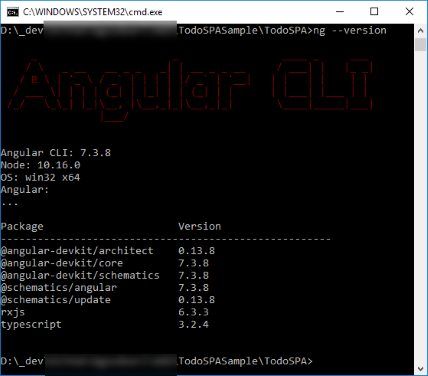
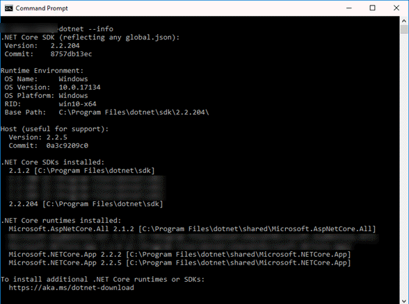
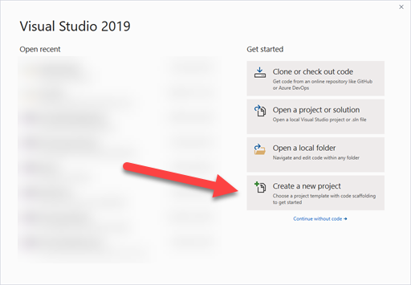
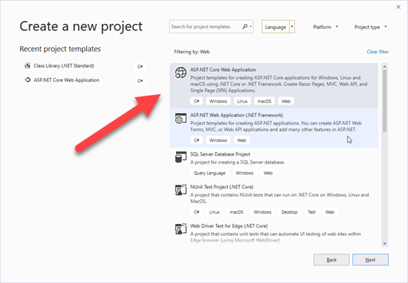
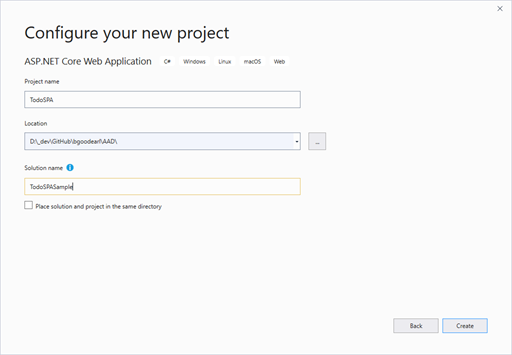
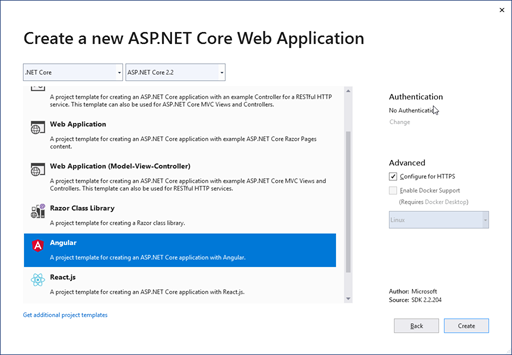

# Angular 7 Web App with .NET Core Web API and AAD Auth with MSAL

This repo contains a sample application created with Visual Studio 2019 using .NET Core 2.2 and Angular 7.

The Web API for the application comes from the [JavaScript Single Page Application with an ASP.NET backend, using msal.js](https://github.com/Azure-Samples/active-directory-javascript-singlepageapp-dotnet-webapi-v2).

## Initial Setup

**IMPORTANT**

If you don't already have it, I highly recommend Mads Kristensen's [Open Command Line Visual Studio Extension](http://vsixgallery.com/extension/f4ab1e64-5d35-4f06-bad9-bf414f4b3bbb/), which I use to open a command line for all of the work done in building this sample.

See [_initialSetup/_initialSetupReadme.md](./_initialSetup/_initialSetupReadme.md) and follow the instructions there to copy the files `authconfig-dev-local.ts` and `authconfig-prod.ts` from `_initialSetup\alt-auth` in the root of this solution to
`TodoSPA\ClientApp\src\app-alt\shared\auth`.

You will see additional instructions below in this readme about setting the values in those files.

You will also need the library [Microsoft.Identity.Web](./_docs/MS_Identity_Web.md).  
Follow [this link](./_docs/MS_Identity_Web.md) to see how to build the library for use with this sample.

## Environment

Quick information on environment.

### Node/NPM

```cmd
node --version
v10.16.0

npm --version
6.9.0
```

### Angular 7


### .NET


## Take 1 - Starting from VS2019 GUI

Start Visual Studio 2019 and see the dialog below:



Click on "Create a new project", or if the above dialog was dismissed,  choose File -- New Project.



Filter by Project type `Web` and then click on `ASP.Net Core Web Application` and click `Next`.



Set the Project name, Location and Solution name and click `Create`.



Choose Angular and click `Create`.

Now build and run the application.

## Update Angular 6 to 7

### Angular CLI

Check global npm packages:
```cmd
npm list -g --depth 0
```
got
```txt
C:\ProgramData\npm
+-- @angular/cli@7.3.8
+-- auth0-deploy-cli@3.0.1
+-- gulp@3.9.1
+-- http-server@0.11.1
+-- live-server@1.2.0
+-- npm@6.9.0
+-- npm-windows-upgrade@6.0.1
+-- rxjs-tslint@0.1.7
+-- tslint@5.18.0
```

```cmd
ng update
```
got
```txt
    We analyzed your package.json, there are some packages to update:

      Name                                      Version                  Command to update
     ---------------------------------------------------------------------------------------
      @angular/cli                              6.0.8 -> 8.0.3           ng update @angular/cli
      @angular/core                             6.1.10 -> 8.0.2          ng update @angular/core
      @angular/core                             6.1.10 -> 7.2.15         ng update @angular/core
      @nguniversal/aspnetcore-engine            6.0.0 -> 7.1.1           ng update @nguniversal/aspnetcore-engine
      rxjs                                      6.2.1 -> 6.5.2           ng update rxjs


    There might be additional packages that are outdated.
    Or run ng update --all to try to update all at the same time.
```

With Angular CLI v7.3.8 installed globally, and version specified in package.json at ~6.0.0, to update to 7.3.8 for project:
```cmd
ng update @angular/cli@7.3.8
```
Updated `@angular/cli` in `package.json`.

```cmd
ng update @angular/core@7.2.15
```
updated multiple packages in `package.json`.

```cmd
ng update
```
got
```txt
    We analyzed your package.json, there are some packages to update:

      Name                                      Version                  Command to update
     ---------------------------------------------------------------------------------------
      @angular/cli                              7.3.9 -> 8.0.3           ng update @angular/cli
      @angular/core                             7.2.15 -> 8.0.2          ng update @angular/core
      @nguniversal/aspnetcore-engine            6.0.0 -> 7.1.1           ng update @nguniversal/aspnetcore-engine


    There might be additional packages that are outdated.
    Run "ng update --all" to try to update all at the same time.
```

Compiled and ran and app runs successfully.

## Todo Web API

After looking at a number of Todo application samples, the [Tutorial: Create a web API with ASP.NET Core](https://docs.microsoft.com/en-us/aspnet/core/tutorials/first-web-api?view=aspnetcore-2.2&tabs=visual-studio)
looked to be the best to use.

Copied files from the [AspNetCore.Docs samples - 2.2 TodoApi](https://github.com/aspnet/AspNetCore.Docs/tree/master/aspnetcore/tutorials/first-web-api/samples/2.2/TodoApi)

```txt
Controllers\TodoController.cs

Models\TodoContent.cs
TodoItem.cs
```
Changed namespace from `TodoApi` to `TodoSPA`.

Added the following in Startup.cs:

```cs
using Microsoft.EntityFrameworkCore;
//...
using TodoSPA.Models;
```
and
```cs
    services.AddDbContext<TodoContext>(opt =>
        opt.UseInMemoryDatabase("TodoList"));
```

### First API test
Compiled app and tried API url: `https://localhost:44358/api/todo`.

Got:
```txt
[{"id":1,"name":"Item1","isComplete":false}]
```

## Todo Angular UI

Adapted code from `\microsoft-authentication-library-for-js\lib\msal-angular\samples\MSALAngularDemoApp\src\todo-list`
so it could be used with the API sample.

### New Files

File in src\app\common
```txt
HttpServiceHelper.ts
```
Files in src\todo-list:
```txt
todo-list.component.css
todo-list.component.html
todo-list.component.spec.ts
todo-list.component.ts
todo-list.service.ts
todoList.ts
```

### Changes in todo-list files
The object model of the C# Web API sample uses the property `Name` where the demo sample code for the MSAL demo uses the property `Title`.

Changes from sample repo:

#### HttpServiceHelper.ts

```TypeScript
import {Observable} from 'rxjs/Rx'
import {HttpClient} from "@angular/common/http";
import {Injectable} from "@angular/core";

@Injectable()
export class HttpServiceHelper {

  constructor(private http: HttpClient) {
  }

  public httpGetRequest(url : string) {
    return this.http.get(url)
      .map(response => {
        return response;
      })
      .catch(response => (Observable.throw(response)
      ))
  }

}
```
to
```TypeScript
import { Observable } from 'rxjs';
import { HttpClient } from "@angular/common/http";
import { Injectable } from "@angular/core";
import { map, catchError } from 'rxjs/operators';

@Injectable()
export class HttpServiceHelper {

  constructor(private http: HttpClient) {
  }

  public httpGetRequest(url : string) {
    return this.http.get(url)
      .pipe(map(response => {
        console.log("http response");
        return response;
      }),
      catchError(response => (Observable.throw(response)
      )))
  }

}
```

#### todo-list.component.html
```html
        <td>{{item?.title}}</td>
```
changed to
```html
        <td>{{item?.name}}</td>
```

#### todo-list.component.ts

Updates to rxjs, commented out msal related code for now.
```TypeScript
import {Subscription} from "rxjs/Subscription";
import {BroadcastService} from "@azure/msal-angular";
import { MsalService} from "@azure/msal-angular";
```
to
```TypeScript
import {Subscription} from "rxjs";
//import {BroadcastService} from "@azure/msal-angular";
//import { MsalService} from "@azure/msal-angular";
```
...
```TypeScript
  constructor(private todoListService: TodoListService, private broadcastService : BroadcastService, private msalService: MsalService) { }
```
to
```TypeScript
  constructor(private todoListService: TodoListService) { } //, private broadcastService : BroadcastService, private msalService: MsalService) { }
```
...
```TypeScript
        'title': this.newTodoCaption,
```
to
```TypeScript
        'name': this.newTodoCaption,
```

And commented out lines 26-19, 38-41, 44-46 and 80.

#### todo-list.service.ts:
```TypeScript
import {Injectable} from "@angular/core";
import {HttpClient} from "@angular/common/http";
import {Observable} from "rxjs/Rx";
import {TodoList} from "./todoList";

@Injectable()
export class TodoListService {

  private apiEndpoint: string = "https://buildtodoservice.azurewebsites.net/api/todolist";

  constructor(private http: HttpClient) {

  }

  getItems(): Observable<TodoList[]> {
    return this.http.get(this.apiEndpoint)
      .map((response: Response) =>
        response
      )
      .catch(response => (Observable.throw(response)
      ))
  }

  postItem(item: any) {
    return this.http.post(this.apiEndpoint, item, {responseType: 'text'})
      .map((response) => {
        return response;
      })
  }

}
```
to
```TypeScript
import {Injectable} from "@angular/core";
import {HttpClient} from "@angular/common/http";
import {Observable} from "rxjs";
import {TodoList} from "./todoList";
import { map, catchError } from 'rxjs/operators';

@Injectable()
export class TodoListService {

  private apiEndpoint: string = "https://localhost:44358/api/todo";

  constructor(private http: HttpClient) {

  }

  getItems(): Observable<TodoList[]> {
    return this.http.get(this.apiEndpoint)
      .pipe(map((response: TodoList[]) => response
      ),
        catchError(response => (Observable.throw(response))))
  }

  postItem(item: any) {
    return this.http.post(this.apiEndpoint, item, {responseType: 'text'})
      .pipe(map((response) => {
        return response;
      }))
  }

}
```

#### todoList.ts:
```TypeScript
export class TodoList {

  constructor(title:string, owner: string) {
    this.title=title;
    this.owner= owner;
  }

  title:string;
  owner: string;

}
```
to
```TypeScript
export class TodoList {

  constructor(name:string, owner: string) {
    this.name = name;
    this.owner= owner;
  }

  name:string;
  owner: string;

}
```

### Changes in existing files

#### nav-menu.component.html
Added the following as a new `li`:
```html
          <li class="nav-item" [routerLinkActive]='["link-active"]'>
            <a class="nav-link text-dark" [routerLink]='["/todo-list"]'>Todo List</a>
          </li>
```

#### app.module.ts

Added imports:
```TypeScript
import { TodoListComponent } from "./todo-list/todo-list.component";
import { TodoListService } from "./todo-list/todo-list.service";
```
Changed declarations:
```TypeScript
    FetchDataComponent
```
to
```TypeScript
    FetchDataComponent,
    TodoListComponent
```
added to RouterModule.forRoot:
```TypeScript
      { path: 'todo-list', component: TodoListComponent },
```
changed providers:
```TypeScript
  providers: [],
```
to
```TypeScript
  providers: [TodoListService],
```

## ADAL Integration

**NOTES INCOMPLETE HERE** - The notes on ADAL integration are not yet complete (c. late June 2019), though the source can be built and run with the notes here.

**Note:** If you are building your app from scratch (rather than using the [code for this sample from GitHub](https://github.com/bgoodearl/TodoSPASample)), you will need to change the URL for your local application.

For the code in this repository, the URL is `https://localhost:44358`.

I've used the name `TodoSPA_sample_local` when registering in my AAD.

### Auth Settings in Angular app

Added new folders `shared` and `shared\auth` under `ClientApp\src\app`.

Added new file `shared-config.models.ts` in folder `ClientApp\src\app\shared` with the following content:
```TypeScript
export interface AuthConfig {
  authConfigType: string;
  clientId: string;
}
```

Added new file `authconfig.ts` in folder `ClientApp\src\app\shared\auth`:
```TypeScript
import { AuthConfig } from "../../../app/shared/shared-config.models";

//*** Important *** The values in this file in .../ClientApp/src/app/shared/auth
//will be replaced by the contents of a file from .../ClientApp/src/app-alt/shared/auth
//
// See readme.md from root of solution for more information
export const AUTH_CONFIG: AuthConfig = {
  authConfigType: "empty",
  clientId: "00000000-0000-0000-0000-000000000000"
}
```

### Copying Auth Settings from non-versioned code

**IMPORTANT:** Before building this app, see the notes in [_initialSetup/_initialSetupReadme.md](./_initialSetup/_initialSetupReadme.md) and
copy files as directed there.

Replace a portion of `ClientApp\angular.json`
```json
          "configurations": {
            "production": {
              "fileReplacements": [
                {
                  "replace": "src/environments/environment.ts",
                  "with": "src/environments/environment.prod.ts"
                }
              ],
              "optimization": true,
              "outputHashing": "all",
              "sourceMap": false,
              "extractCss": true,
              "namedChunks": false,
              "aot": true,
              "extractLicenses": true,
              "vendorChunk": false,
              "buildOptimizer": true
            }
          }
```
with
```json
          "configurations": {
            "production": {
              "fileReplacements": [
                {
                  "replace": "src/environments/environment.ts",
                  "with": "src/environments/environment.prod.ts"
                },
                {
                  "replace": "src/app/shared/auth/authconfig.ts",
                  "with": "src/app-alt/shared/auth/authconfig-prod.ts"
                }
              ],
              "optimization": true,
              "outputHashing": "all",
              "sourceMap": false,
              "extractCss": true,
              "namedChunks": false,
              "aot": true,
              "extractLicenses": true,
              "vendorChunk": false,
              "buildOptimizer": true
            },
            "dev-local": {
              "fileReplacements": [
                {
                  "replace": "src/app/shared/auth/authconfig.ts",
                  "with": "src/app-alt/shared/auth/authconfig-dev-local.ts"
                }
              ]
            }
          }
```

Add to `scripts` in `package.json`:
```json
    "build:devlocal": "ng build --aot=true --configuration=dev-local",
```


### Azure Active Directory Application Registration

Follow the instructions in the Quickstart to register your application.

[Quickstart: Register an application with the Microsoft identity platform](https://docs.microsoft.com/en-us/azure/active-directory/develop/quickstart-register-app)

### Set values in authconfig-dev-local.ts

[If not done yet, copy the files into `TodoSPA\ClientApp\src\app-alt\shared\auth` as described earlier in this readme.]


## Resources

See the following pages for additional resources

[Developer Tool Notes](./_docs/TSS_DevToolNotes.md)

[Azure Active Directory Resources](./_docs/AzureADResources.md)

Additional resources: [Resources](./_docs/TSS_Resources.md)

## Dev Notes

[Developer Notes](./_docs/TSS_DevNotes.md)
